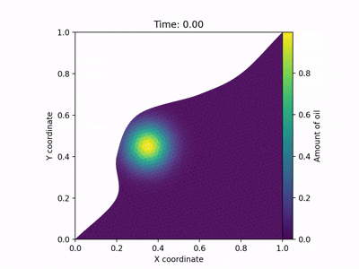

# Oil Spill Simulation

A finite volume method simulation for modeling oil spill dispersion in coastal waters, developed as a university project demonstrating numerical methods and software engineering practices.

*INF203 Project - NMBU, June 2024*

## Oil Dispersion Animation

<div align="center">


</div>

## Authors

- Marcus Dalaker Figenschou - NMBU Student
- Sindri Thorsteinsson - NMBU Student

## Overview

This project simulates oil dispersion in coastal waters using the finite volume method to solve the advection equation. It features configurable parameters, visual animations, and real-time monitoring of oil concentration in fishing grounds.

## Features

- **Finite Volume Method** implementation for accurate numerical simulation
- **TOML Configuration** for flexible parameter management
- **Video Generation** of oil dispersion over time
- **Restart Capability** to continue simulations from saved states
- **Fishing Ground Monitoring** with real-time oil tracking
- **Comprehensive Testing** with full test coverage

## Prerequisites

- Python 3.13+
- UV package manager (recommended) or pip

### Using UV (Recommended)
```bash
# Install UV if you haven't already
curl -LsSf https://astral.sh/uv/install.sh | sh

# Clone repository
git clone <repository-url>
cd oil_spill_sim

# Install dependencies and package with UV
uv sync
uv pip install -e .
```

### Using pip (Alternative)
```bash
# Clone repository
git clone <repository-url>
cd oil_spill_sim

# Install package
pip install -e .
```

## Quick Start

```bash
# Run with default configuration
python -m src.oil_spill_sim.main

# Run with custom configuration
python -m src.oil_spill_sim.main --config-file config.toml

# Run multiple simulations
python -m src.oil_spill_sim.main --config-dir config_files/
```

## Configuration

Create a TOML configuration file:

```toml
[settings]
nSteps = 500        # Number of time steps
tEnd = 0.5          # End time
tStart = 0.0        # Start time (> 0 for restart)

[geometry]
meshName = "bay.msh"                      # Mesh file
borders = [[0.0, 0.75], [0.0, 0.2]]      # Fishing ground boundaries

[IO]
logName = "simulation_log"                # Log file prefix
writeFrequency = 10                       # Video frame frequency
restartFile = ""                          # Optional: path to restart file
```

## Mathematical Model

The simulation solves the advection equation using the finite volume method:

```
∂u/∂t + ∇·(v⃗u) = 0
```

Where:
- `u(t,x⃗)` = oil concentration
- `v⃗(x⃗) = (y - 0.2x, -x)` = velocity field
- Initial condition: Gaussian distribution centered at (0.35, 0.45)

## Project Structure

```
oil_spill_sim/
├── src/oil_spill_sim/
│   ├── main.py              # Entry point and CLI
│   ├── config_reader.py     # TOML configuration handling
│   ├── geometry.py          # Mesh and geometry operations
│   ├── simulation.py        # Core simulation logic
│   └── save_load.py         # State persistence
├── test_files/              # Comprehensive test suite
├── config_files/            # Example configurations
└── README.md
```

## Output

The simulation generates:
- **Video Animation** (`{config_name}.mp4`) - Visual simulation of oil spreading
- **State Files** (`state_step_*.txt`) - Checkpoint files for restart capability
- **Log Files** - Detailed tracking of oil in fishing grounds

## Restart Functionality

Save and continue simulations:

1. States are automatically saved every 100 steps
2. To restart, specify the state file and matching start time:

```toml
[settings]
tStart = 0.25  # Must match time in restart file
[IO]
restartFile = "state_step_100.txt"
```

## Command Line Interface

```bash
Options:
  --config-file PATH    Single configuration file
  --config-dir PATH     Directory with multiple configs
  --output-dir PATH     Output directory (default: results)
  -h, --help           Show help message
```

## Testing

Run the test suite to verify functionality:

```bash
python test_files/test_save_load.py
python test_files/test_geometry.py
python test_files/test_mesh.py
python test_files/test_simulation.py
```

## Development

```bash
# Run with UV
uv run python -m src.oil_spill_sim.main

# Run tests with UV
uv run pytest test_files/
```

## Technical Details

- **Numerical Method**: Finite volume with upwind flux calculation
- **Time Integration**: Explicit Euler method
- **Mesh Format**: Gmsh (.msh) triangular elements
- **Visualization**: Matplotlib for animations and plots
- **Configuration**: TOML with validation and error handling

## License

Educational project for INF203 at Norwegian University of Life Sciences (NMBU).

---

*For detailed documentation, see the source code and test files.*
